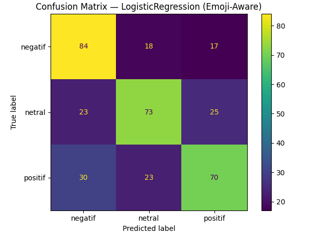
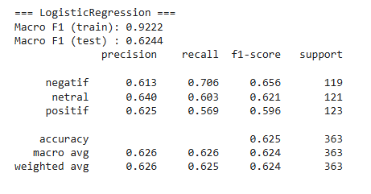
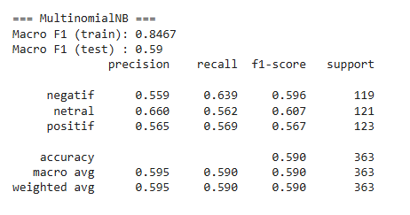

# Analisis Sentimen Tweet Bahasa Indonesia (Emoji-Aware)

Proyek ini membangun pipeline lengkap untuk **analisis sentimen tweet Bahasa Indonesia**  
menggunakan **machine learning klasik (TF-IDF + Logistic Regression / Naive Bayes)**  
dengan **preprocessing berbasis Sastrawi** serta **penggunaan emoji sebagai sinyal emosi**.

---

## 📁 Struktur Proyek

```
AFI_Project1/
│
├── data/                         # Dataset mentah
│   └── tweet.csv
│
├── notebooks/                    # Notebook utama (Google Colab)
│   └── Sentiment_Modeling_Colab_Patched_Emoji.ipynb
│
├── results/                      # Hasil model dan evaluasi
│   ├── sentiment_distribution.png
│   ├── CF_LogReg.png
│   ├── F1Score_LogReg.png
│   ├── F1Score_NB.png
│   ├── model_LogisticRegression_emoji.joblib
│   ├── model_comparison_emoji.csv
│   └── confusion_matrix_LogisticRegression_emoji.png
│
├── utils/
│   └── inference_emoji.py        # Script inferensi mandiri
│
└── Analisis-Sentimen-Tweet-Bahasa-Indonesia-Emoji-Aware.pdf # Slide Presentasi
│
└── README.md
```

---

## 🧾 Deskripsi Dataset

### Analisis Singkat Dataset

- Jumlah data: **1,815** baris  
- Jumlah kolom: **3**
- Kolom utama: `Unnamed: 0`, `sentimen`, `tweet`

### Distribusi Sentimen
| Sentimen | Jumlah | Persentase |
|-----------|---------|------------|
| Positif | 612 | 33.72% |
| Netral | 607 | 33.44% |
| Negatif | 596 | 32.84% |

### Panjang Tweet
- Rata-rata panjang tweet: **194.7 karakter**
- Minimum: **27**
- Maksimum: **668**
- Median: **200**

Dataset memiliki distribusi sentimen yang **seimbang** dengan variasi panjang teks yang wajar  
(sebagian besar antara 130–250 karakter). Hal ini ideal untuk pelatihan model klasifikasi sentimen.

#### 📊 Visualisasi Distribusi Sentimen


---

## 🧹 Tahapan Preprocessing (Emoji-Aware)

Pipeline preprocessing menggunakan kombinasi *regex*, *emoji demojize*, dan *Sastrawi*:

### Langkah-langkah:
1. **Lowercasing** – ubah semua huruf menjadi huruf kecil  
2. **Hapus URL**, tetapi **pertahankan hashtag dan mention (@, #)**  
3. **Konversi emoji ke teks** menggunakan `emoji.demojize()`  
   - Contoh: 😭 → `emoji_sob`, ❤️ → `emoji_red_heart`
4. **Kelompokkan emoji menjadi token umum**:
   - Positif: 😂😍❤️👍 → `emoji_positive`
   - Negatif: 😡😭😢👎 → `emoji_negative`
5. **Hapus stopword Bahasa Indonesia** menggunakan `Sastrawi.StopWordRemoverFactory`  
6. **Stemming Bahasa Indonesia** dengan `Sastrawi.StemmerFactory`  
7. Normalisasi spasi

### Contoh:
| Asli | Setelah Preprocessing |
|------|------------------------|
| “Aduh… kecewa banget 😭” | `aduh kecewa banget emoji_negative` |

---

## ⚙️ Ekstraksi Fitur — TF-IDF

```python
tfidf = TfidfVectorizer(
    ngram_range=(1,2),
    min_df=2,
    max_df=0.95,
    max_features=30000,
    sublinear_tf=True
)
```

- Mengambil unigram dan bigram  
- Menjaga token emoji dan hashtag  
- Menggunakan skala logaritmik (sublinear TF)

---

## 🤖 Model yang Digunakan

| Model | Deskripsi |
|--------|------------|
| **Multinomial Naive Bayes** | Baseline cepat dan efisien untuk teks |
| **Logistic Regression** | Klasifikasi linear dengan regularisasi L2 |

Pipeline yang digunakan:
```
TF-IDF → Classifier
```

Data dibagi 80% train dan 20% test menggunakan `train_test_split(stratify=y)`.

---

## 📊 Evaluasi Model

### Hasil Evaluasi Kuantitatif

| Model | Macro F1 (Train) | Macro F1 (Test) | Akurasi | Catatan |
|--------|------------------|------------------|----------|----------|
| MultinomialNB | 0.8467 | 0.590 | 0.590 | Baseline stabil |
| LogisticRegression | **0.9222** | **0.624** | **0.625** | Performa terbaik ✅ |

> Logistic Regression menunjukkan peningkatan F1-test dibandingkan Naive Bayes,  
> terutama pada label *negatif* dan *netral*.

### Visualisasi Performa

#### Confusion Matrix (Logistic Regression Emoji-Aware)


#### F1-Score Logistic Regression


#### F1-Score Multinomial Naive Bayes


---

## 💾 Model Tersimpan

| File | Deskripsi |
|------|------------|
| `model_LogisticRegression_emoji.joblib` | Model terbaik (TF-IDF + Logistic Regression) |
| `model_comparison_emoji.csv` | Perbandingan F1 train/test |
| `CF_LogReg.png` | Confusion Matrix |
| `F1Score_LogReg.png` | Hasil evaluasi Logistic Regression |
| `F1Score_NB.png` | Hasil evaluasi Multinomial Naive Bayes |
| `sentiment_distribution.png` | Visual distribusi sentimen dataset |

Semua hasil otomatis disimpan ke:
```
/content/drive/MyDrive/Proyek/SentimentFinalEnhancedNew
```

---

## 💬 Inferensi (Prediksi Teks Baru)

Gunakan `utils/inference_emoji.py` untuk menjalankan prediksi:

```bash
python utils/inference_emoji.py
```

### Contoh Output:
```
Text  : Mantap banget acaranya! 😂🔥 #keren
Clean : mantap banget acaranya emoji_positive keren
Pred  : positif
Top   : positif | prob: 0.91
```

Atau langsung gunakan fungsi di Python:
```python
from utils.inference_emoji import predict_sentiment
predict_sentiment("Aduh kecewa banget 😭")
```
Atau menggunakan URL : https://sentimentapi-production-bb07.up.railway.app/docs
---

## ☁️ Menjalankan di Google Colab

1. Mount Google Drive:
   ```python
   from google.colab import drive
   drive.mount('/content/drive')
   ```
2. Pastikan path dataset:
   ```python
   DATA_PATH = "/content/drive/MyDrive/Proyek/Data/tweet.csv"
   ```
3. Jalankan notebook:
   ```
   notebooks/Sentiment_Modeling_Colab_Patched_Emoji.ipynb
   ```
4. Semua hasil akan otomatis disimpan ke:
   ```
   /content/drive/MyDrive/Proyek/SentimentFinalEnhancedNew
   ```

---

## 🧰 Dependensi

| Library | Fungsi |
|----------|--------|
| `pandas`, `numpy` | Manipulasi data |
| `scikit-learn` | TF-IDF, model ML, evaluasi |
| `Sastrawi` | Stemming & stopword Bahasa Indonesia |
| `emoji` | Konversi emoji menjadi token teks |
| `matplotlib` | Visualisasi hasil |
| `joblib` | Penyimpanan model |

---

## 🚀 Rencana Pengembangan

- 🔹 Tambah model berbasis *transformer* (IndoBERT)
- 🔹 Visualisasi frekuensi emoji per sentimen
- 🔹 Optimasi TF-IDF (grid search, n-gram lebih lebar)

---

## 👤 Pengembang

**Dikembangkan oleh:** [moonandart](https://github.com/moonandart)  
**Proyek:** [AFI_Project1](https://github.com/moonandart/AFI_Project1)  
**Fokus:** NLP — Analisis Sentimen Tweet Bahasa Indonesia 🇮🇩  
**Kolaborator:** NLP Group B(AlphaGPT) & GPT-5 (AI Project Assistant)

---
